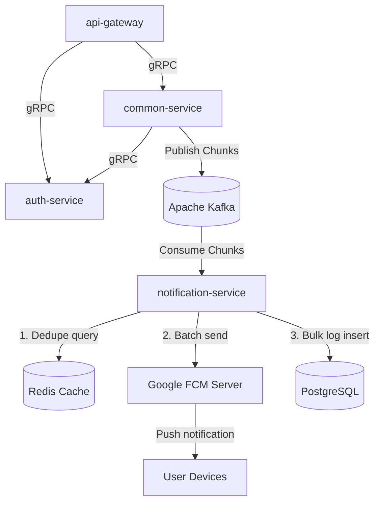
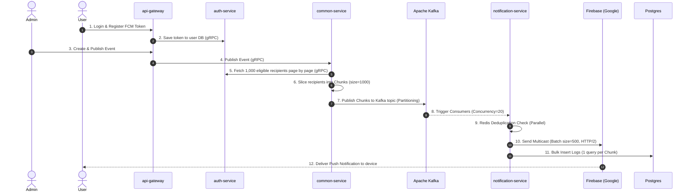
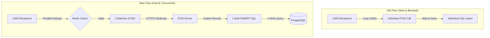

# System Architecture and Documentation

This document provides a comprehensive technical overview of the microservices-based push notification delivery system, covering repository structure, technology stack, workflows, current configurations, key optimizations, and system limitations.

---

## 1. System Overview & Technology Stack

The project is a high-throughput, horizontally scalable push notification campaign system designed to register device tokens, manage marketing/promotion events, query eligible audiences, and dispatch bulk notifications to user devices via Google Firebase Cloud Messaging (FCM).


### Technology Stack & Roles

| Technology | Role / Purpose |
| :--- | :--- |
| **NestJS (Node.js)** | Core framework for all backend services (API Gateway, Auth, Common, Notification). |
| **Apache Kafka** | Event-streaming backbone used to decouple heavy notification dispatching tasks from business services. |
| **PostgreSQL (Supabase)**| Relational database for persistent storage (users, tokens, events, and logs). |
| **Redis** | In-memory store for real-time deduplication and rate limiting. |
| **gRPC** | High-performance, low-latency RPC protocol for internal communication between services. |
| **Firebase Admin SDK** | Official Google API adapter used to dispatch push notifications to Android and iOS devices. |
| **Expo / React Native** | Cross-platform mobile client framework for users to authenticate and receive push notifications. |

---

## 2. Directory Structure

The project is structured as a Monorepo containing two submodules/repositories: `backend/` and `frontend/`.

```
nestjs/microservices-app/
├── backend/                             # Backend Workspace (Submodule)
│   ├── .github/workflows/               # CI/CD pipelines (deploy.yml)
│   ├── packages/                        # Shared npm packages / contracts
│   │   ├── contracts/                   # Shared Zod schemas and Protobuf specs
│   │   └── shared/                      # Logging utilities, errors, and array chunkers
│   ├── services/                        # Microservices
│   │   ├── api-gateway/                 # REST API entry point for frontend and admin client
│   │   ├── auth-service/                # User authentication, profiles, and device token storage
│   │   ├── common-service/              # Event management, target audience query, and chunking
│   │   └── notification-service/        # Kafka consumer, Redis dedupe, and FCM dispatcher
│   ├── docker-compose.yml               # Local infrastructure compose file
│   └── docker-compose.prod.yml          # Production container layout
└── frontend/                            # Expo React Native App (Submodule)
    ├── app/                             # File-based navigation structure (User and Admin panels)
    └── src/                             # Shared React Native code, custom hooks, and API clients
```

---

## 3. Workflows and Architecture Flow

### Component Relationship Topology



### Detailed Sequence Diagram



### Detailed Workflow Description
1. **Token Registration**: When a user logs into the Expo app, it requests notification permissions from the OS, retrieves a native Google FCM token, and hits the API Gateway. The Gateway forwards the token to `auth-service` via gRPC to persist it under the user's record.
2. **Event Publishing**: The admin publishes an event (e.g. `Event 1` for 95,000 users) via the Admin Panel. The request is processed by `common-service`.
3. **Audience Chunking**: `common-service` queries `auth-service` via gRPC page-by-page (1000 users per page) to retrieve eligible users. It divides the 95,000 users into **95 chunks** (1000 recipients per chunk).
4. **Kafka Dispatch**: The chunks are published as separate messages on the Kafka topic `event.notification.created`. Kafka uses the default hash key partitioner to distribute these 95 messages across 500 partitions.
5. **Consumer Pipeline**:
   - `notification-service` instances consume messages from Kafka.
   - For each chunk:
     1. It performs parallel deduplication checks against Redis to ensure a user doesn't receive duplicate notifications.
     2. It groups the remaining eligible users into batches of 500.
     3. It calls `sendMulticast` which triggers Firebase's `sendEachForMulticast()` API. This uses multiplexed HTTP/2, packing 500 push requests into a single network connection.
     4. Successfully sent tokens are recorded in Redis dedupe keys.
     5. The results are gathered, and a single TypeORM bulk SQL `INSERT` is sent to PostgreSQL (`notification_logs`) for all 1000 logs in the chunk.

---

## 4. Current Configurations & Parameters

| Parameter | Configuration Value | Location / Environment | Purpose |
| :--- | :--- | :--- | :--- |
| `EVENT_CHUNK_SIZE` | **1,000** | `backend/.env` | The number of recipients packed into a single Kafka message chunk. |
| `KAFKA_TOPIC_PARTITIONS` | **500** | `backend/.env` | Total partitions allocated for the consumer queues, enabling high parallel routing. |
| `partitionsConsumedConcurrently` | **20** | `notification-service/main.ts` | The maximum number of Kafka partitions processed concurrently per Node.js instance. |
| `notification-service` scale | **4** | `deploy.yml` | The count of backend worker containers running in the production EC2 Docker setup. |
| Total Concurrent Slots | **80** | Calculation | $4 \text{ instances} \times 20 \text{ concurrency} = 80$ slots. |

---

## 5. Key Optimizations Implemented

We resolved three critical production bottlenecks:

### Performance Pipeline Optimization



1. **DB Connection Pool Starvation (Bulk Logging)**:
   * *Problem*: The consumer used to write logs one-by-one (`this.repository.save(log)`) for all 95,000 users, generating 95,000 individual SQL inserts. This exhausted the DB connection pool, causing query timeouts and freezing the database server.
   * *Optimization*: Replaced individual inserts with `this.repository.insert(logsArray)`. Now, the service writes all 1,000 logs of a chunk using a single SQL query, reducing DB I/O load by **1000x**.
2. **Network Socket Exhaustion (FCM Multicast)**:
   * *Problem*: Dispatched notifications one-by-one. 95,000 HTTP requests created a TCP socket backlog, leading to port exhaustion. Under load, new HTTP requests (such as publishing a second concurrent event) were delayed in the Node.js socket queue.
   * *Optimization*: Integrated Google's HTTP/2 multicast API `sendEachForMulticast()`. Messages are grouped in batches of 500 tokens. This reduces the number of connections from 1,000 to **2 connections** per chunk, resolving socket congestion.
3. **Gateway Query Timeout (DB Indexes)**:
   * *Problem*: When users loaded their notifications on the mobile app, the database count query `SELECT COUNT(1) FROM notification_logs WHERE user_id = X` triggered a slow Full Table Scan on the massive table, hitting statement timeouts (500 Internal Server Error) and overloading PostgreSQL CPU.
   * *Optimization*: Created index `@Index(['userId'])` and composite index `@Index(['userId', 'sentAt'])` in the `NotificationLog` entity. Query speed was optimized from several seconds down to **under 1 millisecond**.

---

## 6. System Limitations and Future Scope

* **Single-Thread Event Loop Limits**: Even with asynchronous I/O, Node.js is single-threaded. Running a high concurrency of `20` partitions per container under extremely heavy loads (such as multiple concurrent 100k events) can occasionally lead to event loop lag. If the event loop lags for more than 60 seconds, KafkaJS heartbeats fail, prompting group rebalances. 
  * *Mitigation*: Adjust `partitionsConsumedConcurrently` downwards (e.g. to 5 or 10) and scale the number of physical container instances horizontally instead.
* **Manual Scale Limits**: Docker Compose does not support dynamic auto-scaling out of the box. Running 4 static instances is a budget-friendly setup but cannot dynamically scale down during idle hours or scale up during massive campaigns.
  * *Mitigation*: Migrate from Docker Compose to **Kubernetes (K8s) + KEDA** (Kubernetes Event-driven Autoscaling) or **AWS ECS Service Auto Scaling**.
* **Database Scaling**: Supabase PostgreSQL is a single write instance. While write queries have been optimized by 1,000x using bulk insert, database I/O could become a bottleneck if campaigns grow to tens of millions of users.
  * *Mitigation*: Implement read-write replication splits or use a distributed datastore for logging.
