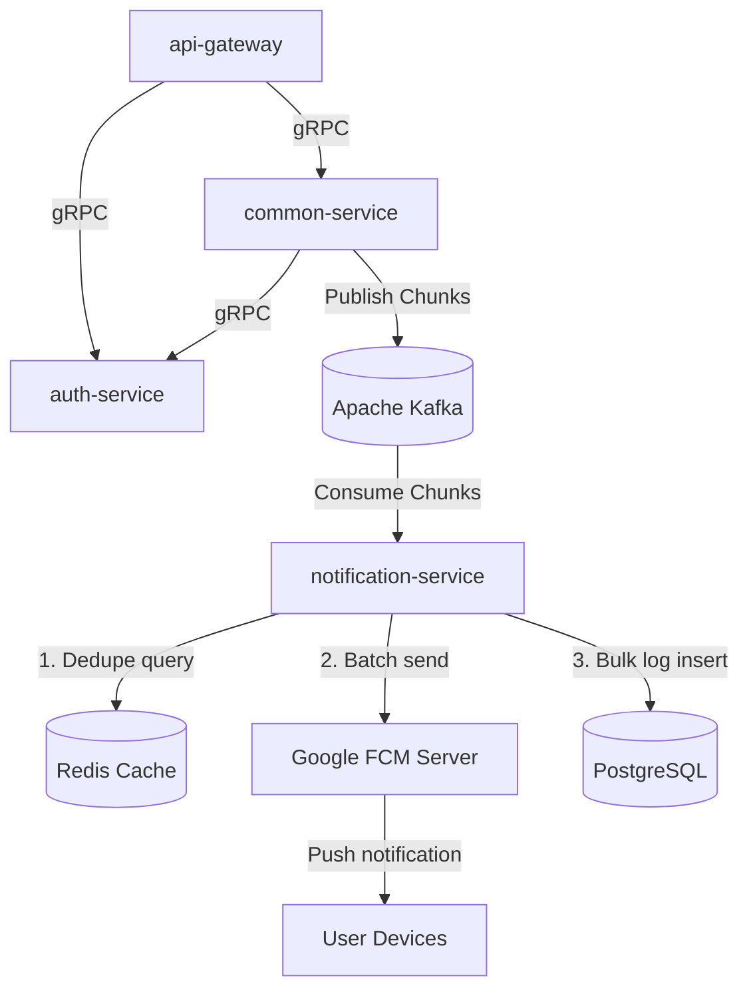
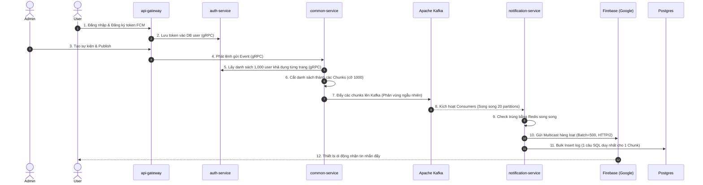
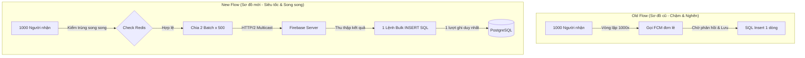

# Kiến Trúc Hệ Thống & Tài Liệu Kỹ Thuật

Tài liệu này cung cấp cái nhìn tổng quan toàn diện về mặt kỹ thuật của hệ thống gửi thông báo đẩy (push notification) dạng microservices, bao gồm cấu trúc thư mục, công nghệ sử dụng, các luồng hoạt động, cấu hình hiện tại, các tối ưu hóa cốt lõi đã thực hiện và giới hạn hệ thống.

---

## 1. Tổng Quan Hệ Thống & Công Nghệ Sử Dụng

Hệ thống được thiết kế theo kiến trúc microservices với mục tiêu chịu tải cao (high-throughput), có khả năng mở rộng ngang tốt. Nhiệm vụ chính là đăng ký thiết bị (FCM token), quản lý sự kiện thông báo marketing hàng loạt, truy vấn đối tượng người dùng phù hợp và gửi thông báo đẩy hàng loạt qua dịch vụ Google Firebase Cloud Messaging (FCM).


### Danh Sách Công Nghệ & Vai Trò

| Công nghệ | Vai trò / Tác dụng |
| :--- | :--- |
| **NestJS (Node.js)** | Framework cốt lõi để xây dựng các dịch vụ Backend (API Gateway, Auth, Common, Notification). |
| **Apache Kafka** | Hệ thống truyền tin dạng luồng sự kiện (Event-streaming) dùng để bất đồng bộ hóa và phân phối tải việc gửi tin nhắn từ dịch vụ nghiệp vụ sang dịch vụ worker gửi tin. |
| **PostgreSQL (Supabase)**| Cơ sở dữ liệu quan hệ dùng để lưu trữ lâu dài (users, tokens, events, và logs). |
| **Redis** | Cơ sở dữ liệu bộ nhớ trong dùng để lọc trùng lặp thời gian thực và quản lý giới hạn tốc độ. |
| **gRPC** | Giao thức RPC hiệu năng cao, độ trễ cực thấp dùng để giao tiếp nội bộ giữa các microservices. |
| **Firebase Admin SDK** | Thư viện adapter chính chủ của Google dùng để giao tiếp và kích hoạt đẩy thông báo đến thiết bị Android/iOS. |
| **Expo / React Native** | Framework xây dựng ứng dụng di động đa nền tảng cho người dùng đăng nhập và nhận thông báo đẩy. |

---

## 2. Cấu Trúc Thư Mục Dự Án

Hệ thống được tổ chức dưới dạng Monorepo chứa 2 submodules lớn: `backend/` và `frontend/`.

```
nestjs/microservices-app/
├── backend/                             # Mã nguồn Backend (Git Submodule)
│   ├── .github/workflows/               # Luồng CI/CD tự động deploy (deploy.yml)
│   ├── packages/                        # Thư viện npm chia sẻ nội bộ
│   │   ├── contracts/                   # Định nghĩa schema Zod và protobuf gRPC chung
│   │   └── shared/                      # Công cụ log, định nghĩa lỗi và hàm chunk mảng
│   ├── services/                        # Danh sách Microservices
│   │   ├── api-gateway/                 # Cổng API REST giao tiếp với client di động/admin
│   │   ├── auth-service/                # Quản lý user, session và token thiết bị (FCM)
│   │   ├── common-service/              # Quản lý sự kiện, phân trang người dùng và chunking
│   │   └── notification-service/        # Consumer Kafka, lọc trùng Redis và gửi FCM
│   ├── docker-compose.yml               # File khởi động hạ tầng ở local
│   └── docker-compose.prod.yml          # File định nghĩa container chạy trên production
└── frontend/                            # Ứng dụng di động Expo (Git Submodule)
    ├── app/                             # Điều hướng ứng dụng di động (Admin và User panels)
    └── src/                             # Code React Native dùng chung, custom hooks và các API client
```

---

## 3. Luồng Hoạt Động Của Hệ Thống (Workflow)

### Sơ đồ liên kết các thành phần (Component Relationship)



### Sơ đồ tuần tự chi tiết (Sequence Diagram)



### Mô tả chi tiết luồng xử lý:
1. **Đăng ký Token**: Khi người dùng đăng nhập vào ứng dụng di động Expo, hệ thống yêu cầu quyền thông báo từ hệ điều hành, lấy FCM Token của Google và gửi về API Gateway. Gateway gọi `auth-service` qua gRPC để lưu token này vào hồ sơ người dùng.
2. **Kích Hoạt Sự Kiện**: Quản trị viên thực hiện Publish chiến dịch (ví dụ sự kiện cho 95,000 người dùng). Yêu cầu này được chuyển vào dịch vụ `common-service`.
3. **Chia nhỏ Dữ liệu (Chunking)**: `common-service` gọi gRPC liên tục sang `auth-service` để lấy danh sách người dùng khả dụng (mỗi trang 1000 users). Sau đó, nó băm danh sách 95,000 users này thành **95 chunks** (mỗi chunk chứa đúng 1000 người).
4. **Phân phối Kafka**: 95 chunks này được ghi dưới dạng các message lên topic `event.notification.created` của Kafka. Kafka sử dụng bộ băm key mặc định để chia đều 95 message này trên **500 phân vùng (partitions)**.
5. **Tiêu thụ & Gửi thông báo (Consumer Pipeline)**:
   * Các instance của `notification-service` kéo tin nhắn từ các partition của Kafka về xử lý.
   * Với mỗi chunk nhận được:
     1. Chạy song song kiểm tra trùng lặp thông qua Redis để đảm bảo không gửi trùng tin cho một user trong cùng một sự kiện.
     2. Gom danh sách người nhận khả dụng còn lại thành các **batch tối đa 500 người**.
     3. Gọi API gửi **Multicast** của Firebase (`sendEachForMulticast()`) bằng công nghệ HTTP/2 multiplexed, gửi 500 tin nhắn chỉ trong 1 kết nối mạng duy nhất.
     4. Ghi nhận khóa trùng lặp vào Redis cho các lượt gửi thành công.
     5. Gom toàn bộ 1000 bản ghi log kết quả (thành công, thất bại, bỏ qua trùng) và thực hiện **1 truy vấn SQL `INSERT` hàng loạt duy nhất** vào PostgreSQL để tránh quá tải DB.

---

## 4. Cấu Hình Hiện Tại Của Hệ Thống

| Tham số cấu hình | Giá trị cấu hình | Vị trí định nghĩa | Tác dụng |
| :--- | :--- | :--- | :--- |
| `EVENT_CHUNK_SIZE` | **1,000** | `backend/.env` | Kích thước số lượng người nhận đóng gói trong 1 tin nhắn Kafka. |
| `KAFKA_TOPIC_PARTITIONS` | **500** | `backend/.env` | Số lượng phân vùng phân chia cho topic xử lý của Kafka để chạy song song. |
| `partitionsConsumedConcurrently` | **20** | `notification-service/main.ts` | Số lượng phân vùng xử lý song song tối đa trên mỗi container worker. |
| Quy mô instance | **4** | `deploy.yml` | Số lượng container `notification-service` chạy trên máy chủ EC2 production. |
| Tổng luồng song song | **80** | Tính toán | $4 \text{ instances} \times 20 \text{ concurrency} = 80$ luồng xử lý đồng thời. |

---

## 5. Các Tối Ưu Hóa Cốt Lõi Đã Thực Hiện

Chúng tôi đã giải quyết thành công 3 điểm nghẽn nghiêm trọng (bottlenecks) trên môi trường production:

### Sơ đồ luồng dữ liệu tối ưu (Optimized Flow)



1. **Giải quyết nghẽn cổng kết nối Database (Bulk Logging)**:
   * *Vấn đề*: Hệ thống cũ ghi log kết quả từng dòng một (`save()`) cho 95,000 người dùng, sinh ra 95,000 câu lệnh SQL `INSERT` riêng lẻ gây tràn bộ nhớ đệm kết nối Database (Database Connection Pool Starvation), làm đơ toàn bộ DB.
   * *Tối ưu*: Chuyển đổi sang phương thức bulk insert của TypeORM (`insert(logsArray)`). Hệ thống ghi 1000 dòng log chỉ bằng **1 câu lệnh SQL duy nhất**, giảm tải I/O cho DB **1000 lần**.
2. **Giải quyết nghẽn đường truyền mạng (FCM Multicast)**:
   * *Vấn đề*: Gửi thông báo đơn lẻ từng người một tạo ra hàng chục nghìn lượt kết nối HTTP/TCP cùng lúc, làm cạn kiệt cổng mạng (Socket Pool Exhaustion) trên máy chủ EC2. Các sự kiện mới như `Event 2` bị xếp hàng nghẽn không thể gửi đi ngay.
   * *Tối ưu*: Sử dụng API gửi Multicast hàng loạt `sendEachForMulticast()` của Firebase qua kết nối HTTP/2. Gom 500 token thiết bị vào 1 request, giảm số lượng kết nối mạng từ 1000 lần xuống chỉ còn **2 kết nối** cho mỗi chunk.
3. **Giải quyết Timeout API xem thông báo (Database Indexes)**:
   * *Vấn đề*: Khi user mở app xem lịch sử thông báo, câu lệnh đếm dữ liệu `SELECT COUNT(1) FROM notification_logs WHERE user_id = X` kích hoạt quét toàn bộ bảng (Full Table Scan) cực kỳ chậm trên bảng log hàng triệu dòng, gây lỗi Timeout 500 và làm CPU của DB quá tải 100%.
   * *Tối ưu*: Thêm chỉ mục `@Index(['userId'])` và composite `@Index(['userId', 'sentAt'])` vào thực thể `NotificationLog`. Thời gian query đếm và lấy lịch sử thông báo giảm từ hàng chục giây xuống **dưới 1 mili-giây**.

---

## 6. Giới Hạn Hiện Tại & Hướng Phát Triển Tương Lai

* **Giới hạn đơn luồng (Event Loop) của Node.js**: Dù có I/O bất đồng bộ, Node.js vẫn là đơn luồng. Cấu hình tiêu thụ song song 20 partitions cùng lúc trên 1 container khi có tải cực lớn (nhiều events 100k cùng lúc) vẫn có thể làm trễ chu kỳ Heartbeat của Kafka, dẫn tới Rebalance.
  * *Hướng xử lý*: Hạ cấu hình `partitionsConsumedConcurrently` xuống mức thấp hơn (khoảng 5 đến 10) và mở rộng ngang (scale) thêm nhiều instance container để xử lý.
* **Hạ tầng co giãn thủ công (Docker Compose)**: Docker Compose không có khả năng co giãn tự động theo tải thực tế. Việc duy trì 4 instances cố định có thể lãng phí tài nguyên khi hệ thống rảnh hoặc thiếu hụt khi chạy nhiều chiến dịch lớn đồng thời.
  * *Hướng xử lý*: Di chuyển hạ tầng sang **Kubernetes (K8s) + KEDA** (co giãn động pod tự động dựa trên độ trễ hàng đợi Kafka - Kafka Consumer Lag) hoặc **AWS ECS Service Auto Scaling**.
* **Nghẽn ghi Database đơn**: Supabase hiện tại chỉ có 1 instance ghi chính. Khi quy mô người dùng tăng lên hàng chục triệu, thao tác bulk insert log vẫn có thể làm chậm DB.
  * *Hướng xử lý*: Phân tách cơ sở dữ liệu đọc-ghi (Read-Write Replication) hoặc sử dụng cơ sở dữ liệu NoSQL chuyên biệt để ghi log.
